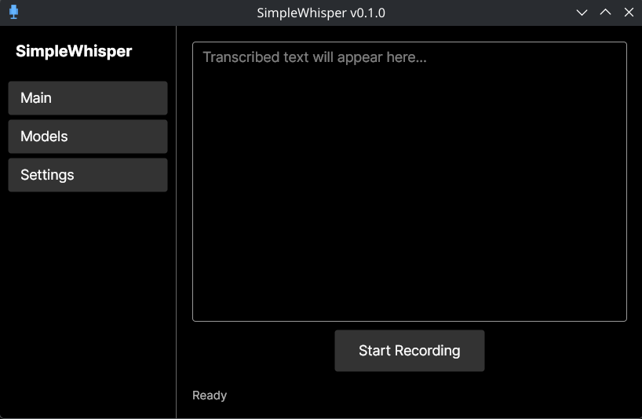

# SimpleWhisper

A lightweight, cross-platform desktop application for voice-to-text transcription powered by [Whisper](https://github.com/openai/whisper).



## Features

- Record audio from any microphone and transcribe it to text
- Global hotkeys for hands-free recording (hold or toggle modes)
- Download and manage Whisper models from within the app
- GPU acceleration (CUDA, Vulkan, CoreML)
- System tray integration for background operation
- Multilingual transcription with language selection
- Output options: copy to clipboard, paste into active window, desktop notifications
- Cross-platform: Windows, macOS, and Linux (X11 and Wayland)

## Requirements

- [.NET 10 SDK](https://dotnet.microsoft.com/download)

## Build & Run

```bash
# Run in debug mode
dotnet run --project SimpleWhisper

# Publish a release build (NativeAOT)
dotnet publish SimpleWhisper -c Release
```

## Installation

Download the latest release from the [Releases](../../releases) page for your platform.

## Used Libraries

| Library | Purpose |
|---------|---------|
| [Avalonia](https://avaloniaui.net/) | Cross-platform UI framework |
| [Whisper.net](https://github.com/sandrohanea/whisper.net) | Speech-to-text transcription via OpenAI Whisper |
| [CommunityToolkit.Mvvm](https://github.com/CommunityToolkit/dotnet) | MVVM source generators and helpers |
| [PortAudioSharp2](https://github.com/PortAudio/portaudio) | Audio recording from microphone |
| [Material.Icons.Avalonia](https://github.com/SKProCH/Material.Icons.Avalonia) | Material design icons |
| [Microsoft.Extensions.Hosting](https://learn.microsoft.com/en-us/dotnet/core/extensions/generic-host) | Dependency injection and app lifecycle |
| [Tmds.DBus.Protocol](https://github.com/tmds/Tmds.DBus) | D-Bus integration for Linux desktop services |

## License

This project is licensed under the [MIT License](LICENCE).
